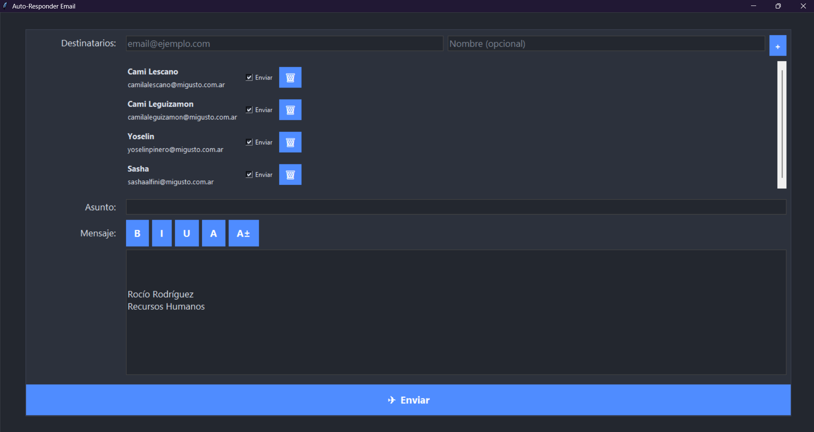

# Enviador de Listas de Distribución para Ferozo Webmail

Aplicación de escritorio que permite manejar listas de distribución (grupos de contactos) y enviar un mismo correo a múltiples destinatarios de forma simple. Está pensada para complementar Ferozo Webmail, que no incluye de forma nativa una funcionalidad de “grupos” o “listas” que disparen un único envío masivo.

## 🚀 Características principales

- **Gestión de destinatarios**: agrega email y nombre opcional, selección por casilla para incluir/excluir y botón de borrar por ítem.
- **Lista scrolleable**: escalable a muchos contactos sin romper el layout.
- **Editor enriquecido**: negrita, cursiva, subrayado, color y tamaño de letra sobre el cuerpo del mensaje.
- **Firma automática**: inserta “Tu nombre – Tu Puesto” al final
- **Envío masivo**: botón “✈ Enviar” con estado “⏳ Enviando…”, resumen de éxitos/fallos y registro
- **Persistencia**: guarda la lista en `destinatarios.json` y la configuración en `config.json`.
- **Ejecución portable**: Compilado en un `.exe` para distribucion.

## ▶️ Cómo usar (versión .exe)

1. Ejecutar `EnviadorMiGusto.exe` (carpeta `dist`).
2. En “Destinatarios”, agregar emails (y nombre opcional). Tildar/desmarcar “Enviar” por contacto.
3. Completar “Asunto”.
4. Redactar el “Mensaje” (el editor inicia con 3 saltos de línea y luego la firma).
5. Presionar “✈ Enviar”. Se mostrará el progreso y resumen final.

> Tip: la firma se agrega automáticamente si no está; si el contenido tiene formato, el envío se hace en HTML.

## 📄 Licencia

Uso interno. Adaptar y distribuir dentro de la organización.