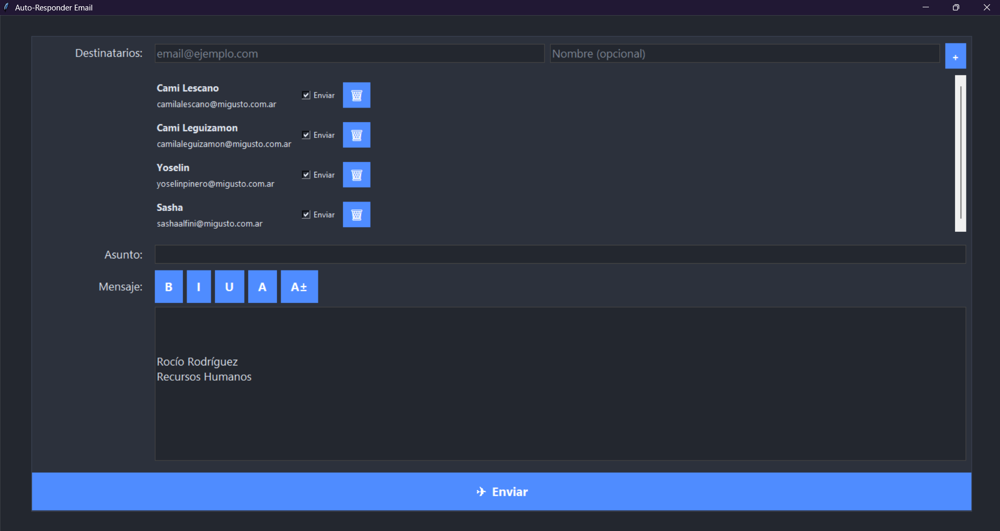

# ✉️ Multi-Mail Sender

**Solución integral y liviana para envíos masivos y gestión de listas de correo**

 

---

## 🎯 Sobre el Proyecto

**Multi-Mail Sender** es una aplicación de escritorio diseñada para simplificar y optimizar la distribución masiva de correos electrónicos. Diseñada para complementar servicios como Ferozo Webmail, Gmail y Outlook, permite gestionar listas de contactos y enviar comunicados masivos con un solo clic.

Con una interfaz intuitiva y elegante, podrás redactar correos con formato enriquecido, administrar tus destinatarios de manera flexible y supervisar el progreso de envío en tiempo real.

---

## ✨ Funcionalidades Principales

| Funcionalidad | Descripción |
| :--- | :--- |
| 📇 **Gestión Dinámica de Contactos** | Agrega, edita o elimina destinatarios fácilmente. Incluye casillas de verificación individual para seleccionar los destinatarios de cada campaña. |
| 📝 **Editor Enriquecido HTML** | Personaliza tus correos con formato de texto (negrita, cursiva, subrayado), selector de color y ajuste de tamaño de fuente. |
| ✒️ **Firma Automática** | Inserción inteligente de firmas corporativas prefijadas al pie del mensaje en formato plano o HTML. |
| 🌐 **Soporte Multi-Servidor** | Integración nativa con **Ferozo Webmail**, **Gmail**, **Outlook** y servidores SMTP/IMAP personalizados. |
| 📊 **Monitoreo en Tiempo Real** | Indicadores visuales de estado (`⏳ Enviando...`), reporte de entregas exitosas/fallidas y registro automático de logs. |
| 💾 **Persistencia Automática** | Guarda automáticamente tu lista de destinatarios, asunto y último borrador para retomar tu trabajo al instante. |

---

## 💡 Flujo de Trabajo

1. **Selecciona tus Destinatarios**: Gestiona tu lista de distribución activando únicamente las casillas de los contactos deseados.
2. **Diseña tu Mensaje**: Redacta el asunto y cuerpo del correo aplicando estilos con el editor enriquecido.
3. **Envía y Supervisa**: Presiona el botón de envío para procesar la lista y recibe una confirmación detallada del estado de entrega.

---

*Herramienta desarrollada para potenciar la comunicación masiva de forma ágil, confiable y profesional.*

